# Skier's Guide

Skier's Guide is a comprehensive platform dedicated to enhancing your skiing experience, offering insights into the top ski resorts, unveiling the finest gear of 2024, and providing valuable guidance to help you progress from a skiing newbie to a seasoned pro.

Our guide goes beyond the slopes, delving into the intricacies of skiing techniques and strategies for skiers of all levels, from beginners to intermediates and professionals. Whether you're looking for the perfect resort for your next adventure or seeking advice on the latest and greatest gear, Skier's Guide has you covered.

the live link can be found here - [Skier's Guide](https://antonei.github.io/Skier-s-Guide/)

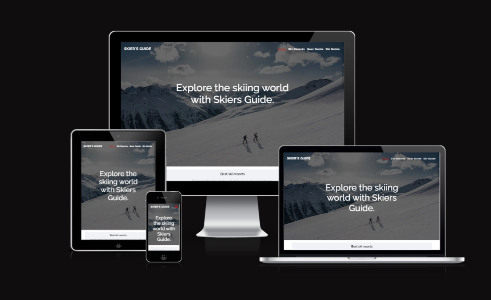

## Site Owner Goals

- To provide the user with key insights into top ski resorts, 2024 gear, and skill progression from newbie to pro.
- To provide the user with precise instructions, images, and benefits for each skill level.
- To provide the user with a calming, responsive platform for easy navigation.
- To Enhance your skiing skills with our in-depth video tutorials, providing step-by-step guidance.
- to explore our in-depth gear section for carefully selected insights and recommendations on the latest ski equipment.

## User Stories
- ### First time user
  - As a first time user I want to understand the main purpose of the site and learn about the benifits of having the best gear in the slopes
  - As a first-time user, I want to navigate the website intuitively, ensuring a positive and enjoyable experience.
  - As a first time user I want to be able to browse ski content without having to sign-up / register.

- ### Returing User
  - As a returning user, I want to effortlessly navigate to the best ski gear that enhances my skiing experience on the slopes.
  - As a returning user, I want to find step-by-step instructions to improve my skills both on and off the slopes, ensuring a comprehensive guide for my skiing journey.
  - As a returning user, I want to easily locate my next skiing destination on the 'Ski Resort Page.

- ### Frequent User
  - As a frequent user, I want to easily discover the best and latest ski gear on the market, ensuring I stay informed and equipped for optimal performance on the slopes.
  - As a frequent user, I want to easily explore and stay updated on valuable tips,

## Design
 
### Imagery 
The imagery used on the Skier Guide site is very important to the overall experience of the user. Captivating images of snow-capped mountains create a sense of adventure and anticipation, transporting users to the exhilarating world of skiing. These visuals not only showcase the breathtaking beauty of the slopes but also evoke the thrill and serenity of the skiing experience.

### Colours
The Skier Guide energetic tones capture the thrill of skiing, while calming hues reflect snow-covered landscapes. Primarily featuring white and gray tones with strategic touches of red.

### Fonts
The Raleway font is the main font used throughout the whole website. This font was imported via [Google Fonts](https://fonts.google.com/). I'm using Sans Serif as a backup font, in case for any reason the main font isn't being imported into the site correctly.

### Wireframes
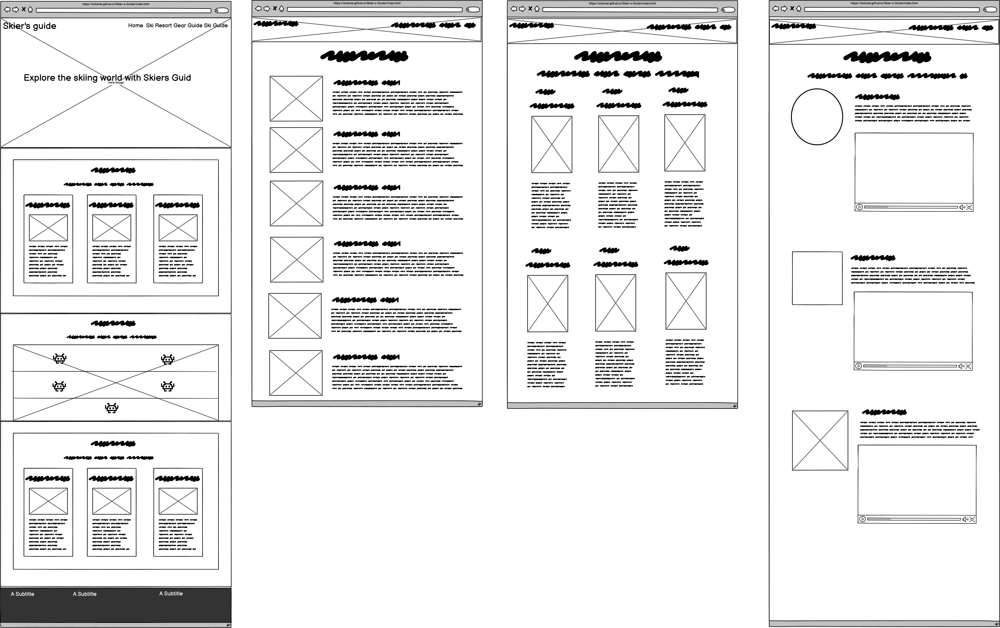
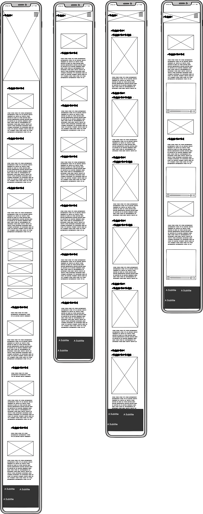

## Features
- ### Navigation

  - The fully responsive navigation bar includes links to the Home, Ski Resorts, Gear Guide, Ski Guide. 
  - On smaller devices, a space-saving dropdown menu is implemented, streamlining navigation for an optimized user experience. This design choice prioritizes efficiency while maintaining the website's clean and intuitive interface.
  - On smaller devices, the dropdown menu features a gray background, enhancing text visibility and ensuring a user-friendly experience by prioritizing clarity and readability.

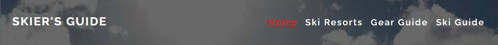

- ### The Landing Page Image
  - The captivating landing page features an enticing image with a compelling text overlay, inviting you to embark on a journey to explore the skiing world with Skiers Guide.
  - This section provides the user with a clear visual representation of the purpose of the site.

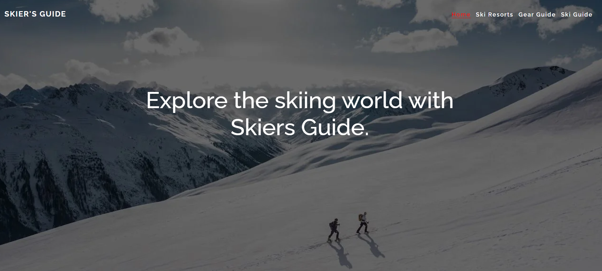

- ### Best Ski Resort Section
  - The Best Ski Resort section offers concise descriptions of our top three ski paradises
  - Above the text, there are small pictures showcasing the ski resort.
  - Below the text, you'll find a link to explore more top resorts on the dedicated page.
 
 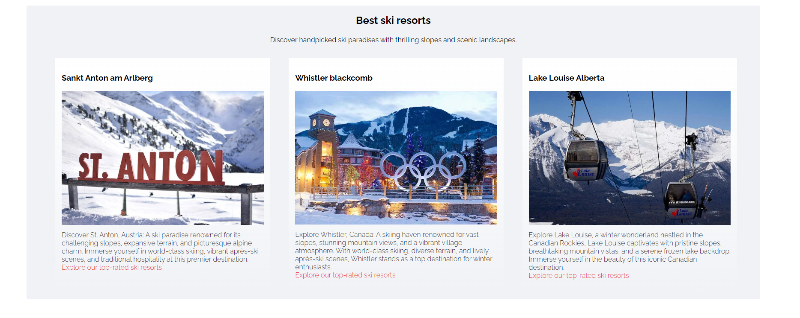 

- ### Best Ski Gear Section
  - This section comprises five blocks, each featuring pictures illustrating skiing gear with a background of an mountain.
  - Each block functions as a link, directing you to the dedicated ski gear page.

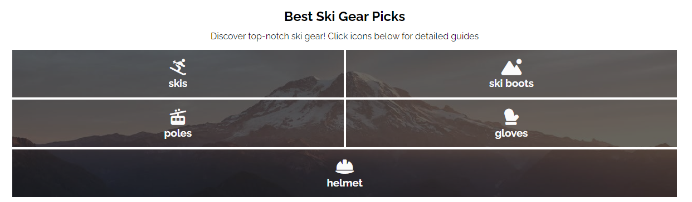

- ### Ski Guide Section
  - The Ski Guide section provides comprehensive skiing instructions tailored for individuals ranging from beginners to intermediates and experts, offering valuable insights for enthusiasts at every skill level.
  - At the end of each text, there's a link to explore other pages for more in-depth information and a comprehensive understanding.
  
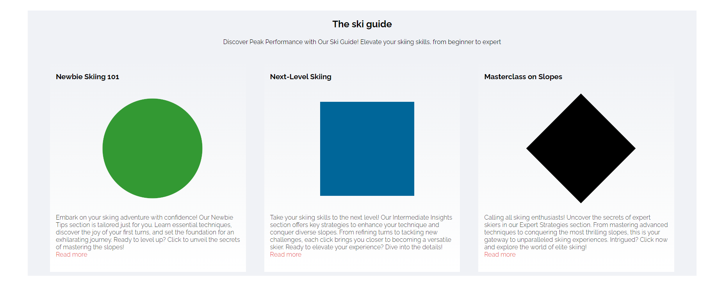

- ### Ski Resort Page
  - On the Ski Guide page, you'll discover a curated list, ranked from 1 to 6, showcasing the best ski resorts out there.
  - Explore additional details about each ski resort.
  -  you can click the provided link to visit the official website of each ski resort for further information.

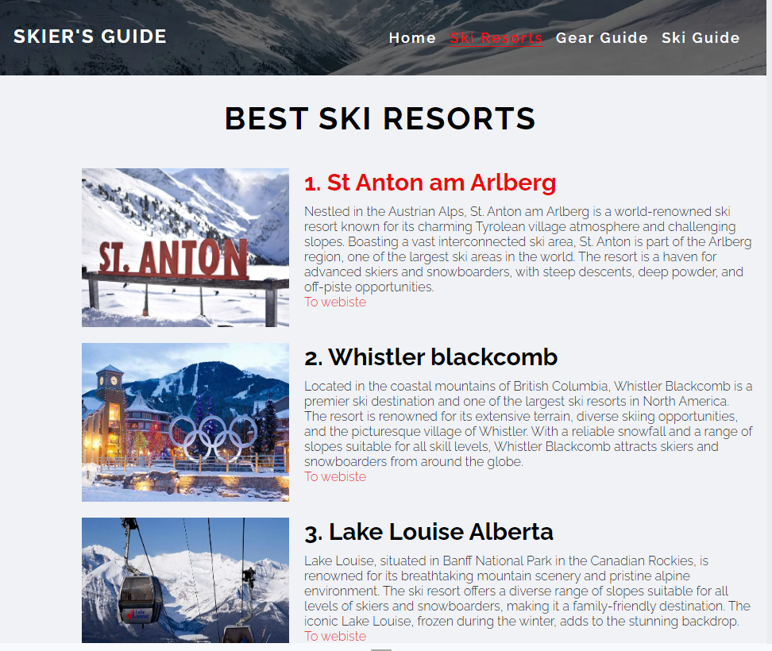

- ### Gear Guide 
  - On the Gear Guide page, discover the latest and most advanced skiing gear available.
  - You can also find detailed information on each piece of gear directly on the page.
  
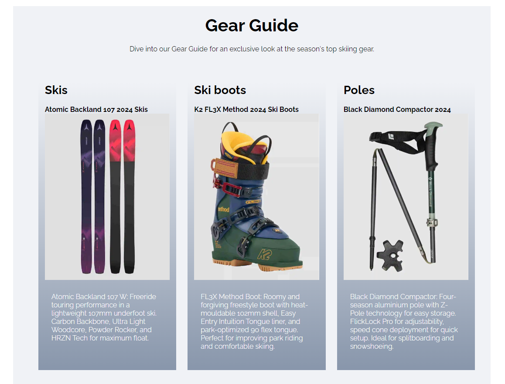 

- ### Ski Guide Page
  - On the Ski Guide page, whether you're a newbie, intermediate, or expert, find valuable assistance and guidance to enhance your skiing skills.
  - Additionally, discover instructional videos on the Ski Guide page demonstrating how to improve your skills, catering to beginners, intermediates, and experts alike.
  
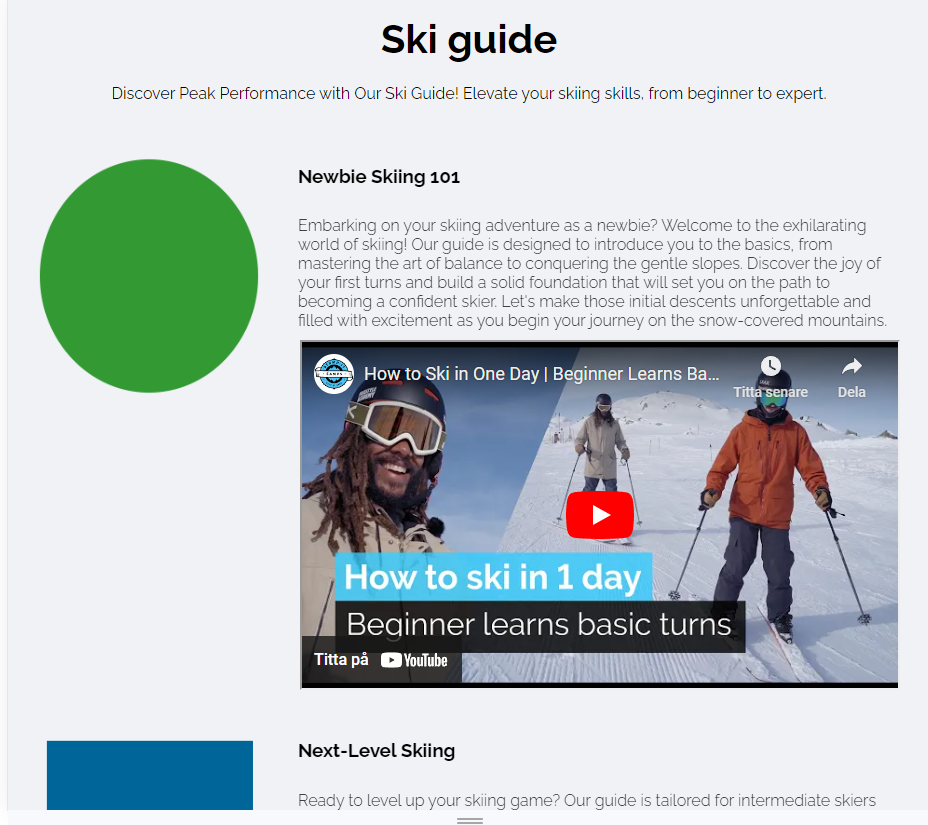

- ### footer 
  - The footer section includes links to Skier's guide's Facebook, Instagram, Twitter and pages.
  - a "contact us" with email and phone number
  - a short about us
  

### Features Left to Implement
- Hover on the gear page

## Testing

### Validator Testing

- #### HTML
  - No errors were returned when passing through the official W3C Markup Validator
    - [W3C Validator Results](https://validator.w3.org/nu/?doc=https%3A%2F%2Faliokeeffe.github.io%2Fmindyoga%2Findex.html)

- #### CSS
  - No errors were found when passing through the official W3C CSS Validator
    - [W3C CSS Validator Results](https://jigsaw.w3.org/css-validator/validator?uri=https%3A%2F%2Fvalidator.w3.org%2Fnu%2F%3Fdoc%3Dhttps%253A%252F%252Faliokeeffe.github.io%252Fmindyoga%252Findex.html&profile=css3svg&usermedium=all&warning=1&vextwarning=&lang=en)

- #### Accessibility
  - The site achieved a Lighthouse accessibility score of 100% which confirms that the colours and fonts chosen are easy to read and accessible

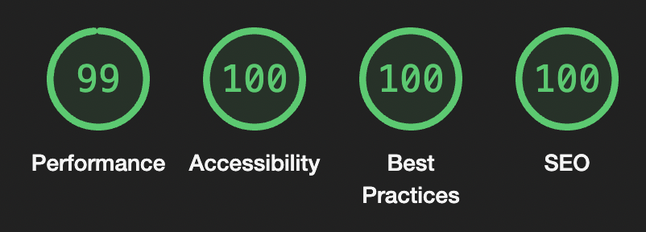

### Links Testing

- All navigation links were tested manually to ensure the user is directed to the correct section of the website.
- Social Media links in the footer of each page were tested manually to ensure they direct the user to the correct page and open in a new tab.

### Browser Testing

- The Website was tested on Google Chrome, Firefox, Microsoft Edge, Safari browsers with no issues noted.

### Device Testing

- The website was viewed on a variety of devices such as Desktop, Laptop, iPhone 8, iPhoneX and iPad to ensure responsiveness on various screen sizes. The website performed as intended. The responsive design was also checked using Chrome developer tools across multiple devices with structural integrity holding for the various sizes.
- I also used the following websites to test responsiveness:
  -  [Responsinator](http://www.responsinator.com/?url=https%3A%2F%2Fantonei.github.io%2FSkier-s-Guide%2Findex.html)
  - [Am I Responsive](https://ui.dev/amiresponsive?url=https://antonei.github.io/Skier-s-Guide/index.html)

### Friends and Family User Testing
Friends and family members were asked to review the site and documentation to point out any bugs and/or user experience issues.

### Fixed Bugs
#### Add font awesome to all pages 

- During the recent development of my website, I encountered an unexpected challenge with the navigation toggle button not displaying as intended. After thorough investigation, I identified the root caused by a missing Font Awesome library in the bottom of the rest of the pages.
  
#### Hr was blocking p
  - During the recent validation of our CSS, the validator alerted us to an unclosed p segment. After meticulous inspection, I traced the issue back to an unexpected hr tag within the paragraph. Realizing that the validator doesn't allow an hr element in between the opening and closing p tags, I promptly corrected the structure, ensuring adherence to best practices.

## Technologies Used

### Languages
- HTML5
- CSS

### Frameworks - Libraries - Programs Used
- [Am I Responsive](http://ami.responsivedesign.is/) - Used to verify responsiveness of website on different devices.
- [Responsinator](http://www.responsinator.com/) - Used to verify responsiveness of website on different devices.
- [Balsamiq](https://balsamiq.com/) - Used to generate Wireframe images.
- [Chrome Dev Tools](https://developer.chrome.com/docs/devtools/) - Used for overall development and tweaking, including testing responsiveness and performance.
- [Font Awesome](https://fontawesome.com/) - Used for Social Media icons in footer.
- [GitHub](https://github.com/) - Used for version control and hosting.
- [Google Fonts](https://fonts.google.com/) - Used to import and alter fonts on the page.
- [TinyPNG](https://tinypng.com/) - Used to compress images to reduce file size without a reduction in quality.
- [W3C](https://www.w3.org/) - Used for HTML & CSS Validation.

## Deployment

The project was deployed using GitHub pages. The steps to deploy using GitHub pages are:

1. Go to the repository on GitHub.com
2. Select 'Settings' near the top of the page.
3. Select 'Pages' from the menu bar on the left of the page.
4. Under 'Source' select the 'Branch' dropdown menu and select the main branch.
5. Once selected, click the 'Save'.
6. Deployment should be confirmed by a message on a green background saying "Your site is published at" followed by the web address.

The live link can be found here - [Skier's Guide](https://antonei.github.io/Skier-s-Guide/index.html)

## Credits

### Content
All educational ski content was sourced from the below websites:
  
  - [Blue-Tomato](https://www.blue-tomato.com/en-SE)
   - [St Anton](https://www.stantonamarlberg.com/en/home)
  - [Whistler](https://www.whistlerblackcomb.com/)
  - [Lake Louise](https://www.skilouise.com/)
  - [Les 3 valles](https://www.les3vallees.com/en)
  - [chamonix](https://en.chamonix.com/)
  - [zermatt](https://www.zermatt.ch/en)

### Media
All images and videos were sourced from the below websites with thanks to the below amazing photographers/videographers
#### Pictures and more
- [Pexels](https://www.pexels.com/)
    - Flo Maderebner -Header
    - Vlada Karpovich - Mountain behind gear guide segment
- Best ski resort pictures are from:
  - [frenchmoments.eu](<https://frenchmoments.eu/chamonix-mont-blanc/>)
  - [epicpass](https://www.epicpass.com/region/europe/france.aspx)
  - [zermatt](<https://www.zermatt.ch/>)
  - [skidorter](<https://www.skidorter.se/st-anton>)
  - [whistlervillagecondos](<https://www.whistlervillagecondos.com/visitor-information/whistler-blackcomb-ski-resort/>)
  - [skilouise](https://www.skilouise.com/)
- Ski Gear picture are from: 
  - [Blue-Tomato](https://www.blue-tomato.com/en-SE)
- Ski guide pitcure and videos are from:
  - Pictures from [Wikipedia](en.m.wikipedia.org)
  - Vidoes:
    - [Stomp It Tutorials](https://www.youtube.com/watch?v=MMeJsyiiifM)
    - [Carv - Digital Ski Coach](https://www.youtube.com/watch?v=1Zcy_nsOwGk)
    - [Red Bull Snow
](https://www.youtube.com/watch?v=fbqHK8i-HdA)

### Resources Used

- inspired by [Demo.templatemonster](https://demo.templatemonster.com/demo/98665.html?
- Inspiration for gear section in home page - [Code Institutes](https://learn.codeinstitute.net/) 'Love Running Project'

## Acknowledgments

My mentor Antonio for his support and advice.

My fellow student Elin Dalenbäck.

The Code Institute slack community for their quick responses and very helpful feedback!
